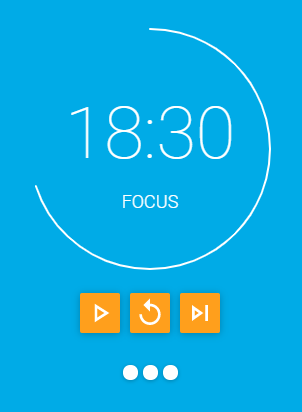

# Electron Pomodoro App

This is the monorepo for the Pomodoro app.

## How to use the app

1. Install all dependencies for each package using the convenience script `sh install-deps.sh`, or go into each package and run `npm install`.
1. Build the app using the convenience script `sh build.sh`, or go into each package and build using the command specified in their own READMEs.
1. Run the app executable from `./electron/NG Pomodoro-win32-x64/NG Pomodoro.exe`.

## Tech

The app is built using:

- Electron
- Node.js
- Angular
- TypeScript
- Sass

Testing is done using:

- Jest
- Spectron
- Cypress

## Packages

The top level folders are packages. Each package contains its own `README.md` inside.

- `electron` - The main Electron process as well as the preload scripts.
- `ng-ui` - The Angular UI app.
- `e2e-electron` - E2E tests for the `electron` package. Specifically tests for integration between the UI and Electron.
- `e2e-ui` - E2E tests for the `ng-ui` package. Specifically tests the UI.

## A Note on E2E

There are two E2E packages in this monorepo. `e2e-electron` is using Spectron and `e2e-ui` is using Cypress. Technically the UI tests could have been covered using Spectron as well. However, Cypress allows for quick, easy, and modern testing which leads to an overall better devleoper experience (at least in my humble opinion for this project). Unfortunately, Cypress as of now does not work with Electron, so it is limited to the UI. Thus, having two packages for E2E testing was worth it in this case.
